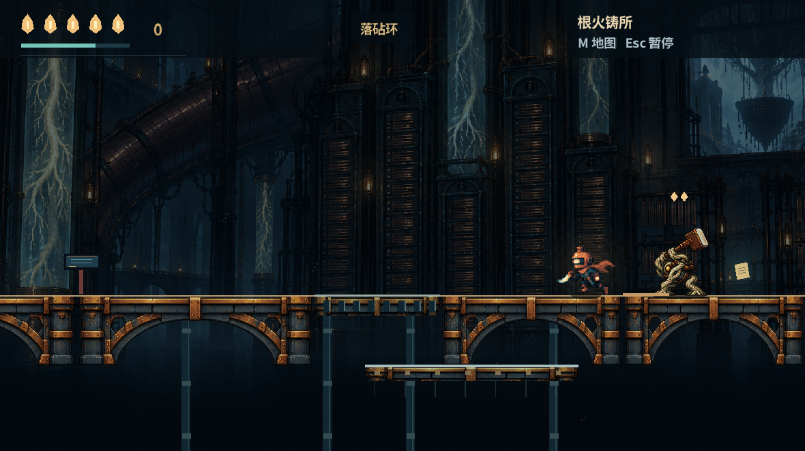

# EMBERWAKE · 余烬回潮

原创 Godot 4.6 像素动作探索游戏。当前工程版本 **0.8.1**，是一张持续扩展的相连世界。

## 运行

1. 下载或克隆本仓库。
2. 用 Godot 4.6.x 导入 `godot/project.godot`。
3. 按 F5。全部运行素材已包含，无需 Python、额外素材或第三方插件。

工程已在 Godot 4.6.3 上验证。它不是独立 macOS 应用；Mac 硬件和独立导出尚未验证。

## 目前内容

- 潮门旧区的上下回路、远端捷径、回声羽隐藏支路、三座信号炉与两阶段守钟人
- 与旧区相连的根火工坊：落砧环、陶封、压力机关、运薪者和回程绞盘
- 相邻冷名廊：记薪人缇芦、两份记录的支线、单/双落锤敌人、可亲自跳回的冷柜踏板，以及通回浸水档案馆的内部捷径
- 灯座、死亡重试、本机自动存档、地图、辅助模式与减少震动

0.8.1 修正第一章结尾的继续路线提示：观测所右侧下层的铜门通向已经可玩的工坊。收起对话会继续旅途。

这是完整世界的阶段性工程。后续区域和区域首领仍在开发，当前没有声称达到完整商业游戏规模。



上图是 0.8.0 的真实 Godot 视口画面。0.8.1 仅改变章节结尾文字与关闭标签，未为这次文字改动重新拍摄原生窗口。

## 操作

| 操作 | 键位 |
| --- | --- |
| 移动 | A/D、左右方向键 |
| 跳跃/短跳 | 空格；提前松开可短跳 |
| 挥刃 | J/Z；上方向上挑、空中下方向下劈 |
| 冲刺/落砧 | K/Shift/X；获得落砧环后空中下方向加冲刺 |
| 交互 | E/Enter |
| 疗愈 | 按住 Q/C，消耗灯芯能量 |
| 地图/暂停 | M/Tab、Esc |
| 静音/全屏 | F8、F11 |

手柄：左摇杆移动，A 跳跃、X 挥刃、B 冲刺、Y 疗愈、RB 交互、十字键/左摇杆选择攻击方向和菜单、Back 地图、Start 暂停。实体手柄手感尚未验证。

## 工程与验证

- `godot/`：完整可编辑工程与所有运行素材
- `art/`：原始创作图、提示记录与历史素材制作脚本
- `docs/ART_PROVENANCE.md`：素材来源；字体许可在 `godot/licenses/`
- `docs/VALIDATION.md`：验证范围与限制
- `builds/pack_source_hashes.json`：已交付 0.8.1 的 55 个运行资源 SHA-256；仓库中的对应资源逐一相同

Godot 内 440 项当前断言通过；独立复核共 456 项，包含相同的 440 项及 16 项额外检查。自动路线/策略不等同于真人手感测试。音频设备在原生测试中回退到静音驱动，因此没有可听混音验证。

可选的 PCK 可以从源码重建，不重复提交大型资源包：

```sh
godot --headless --path godot --script res://tests/build_pack.gd
```

产物为 `builds/Emberwake.pck`。Linux 下安装 Godot 4.6.3、Python 3 和 `timeout` 后，可运行 `bash godot/tests/run_checks.sh`。这套测试脚本通过 XDG 临时目录隔离本机存档，仅按 Linux 流程验证过；不要直接用它测试已有个人 Mac 存档。

本仓库没有部署工作流。既有试玩检查点保留。
